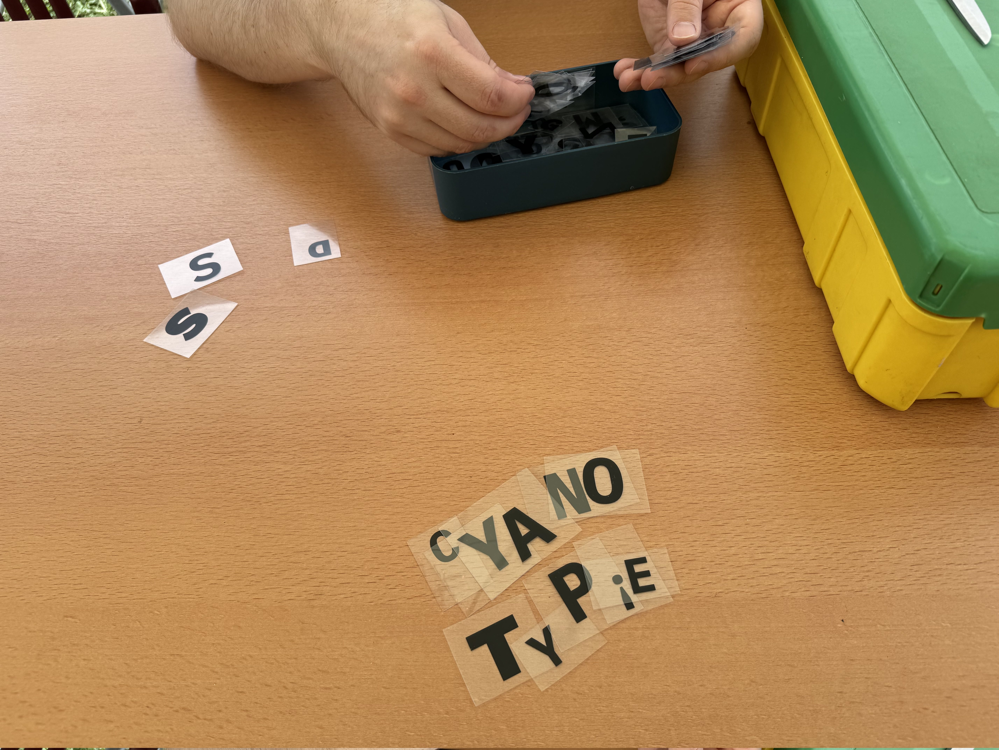
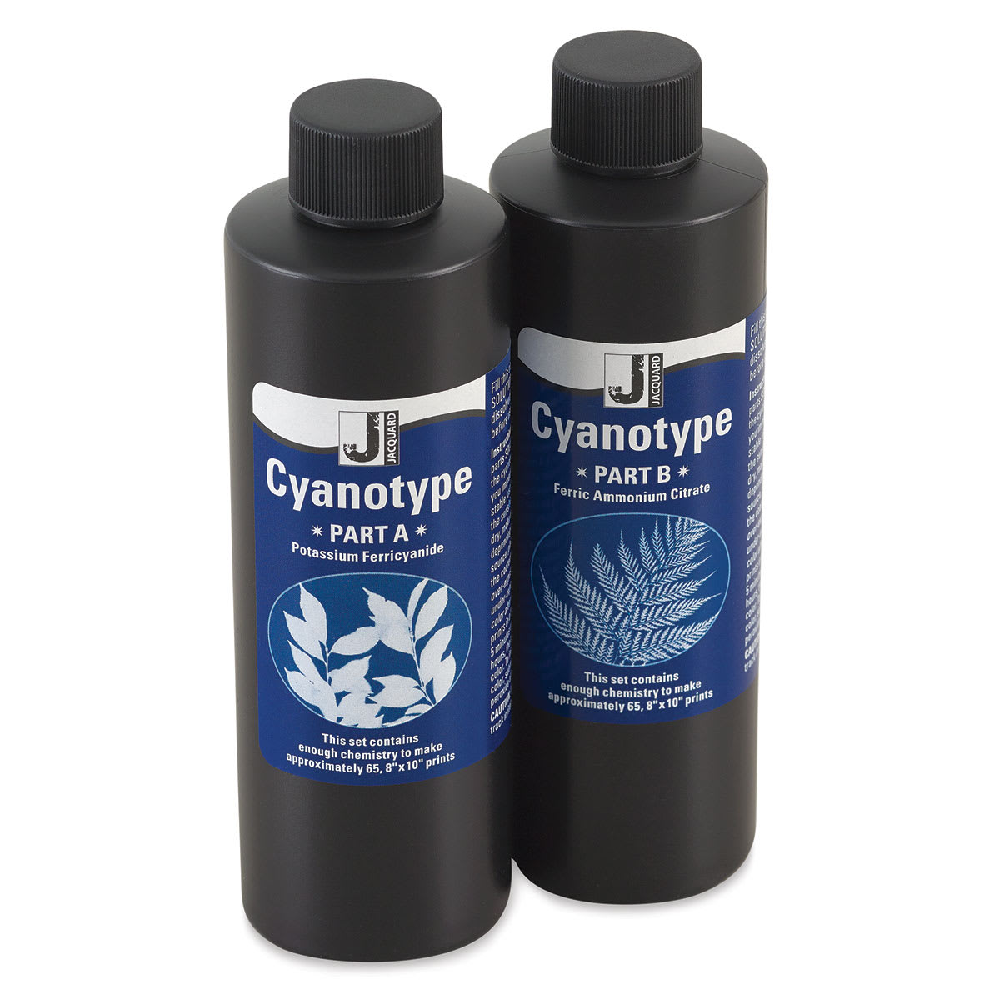
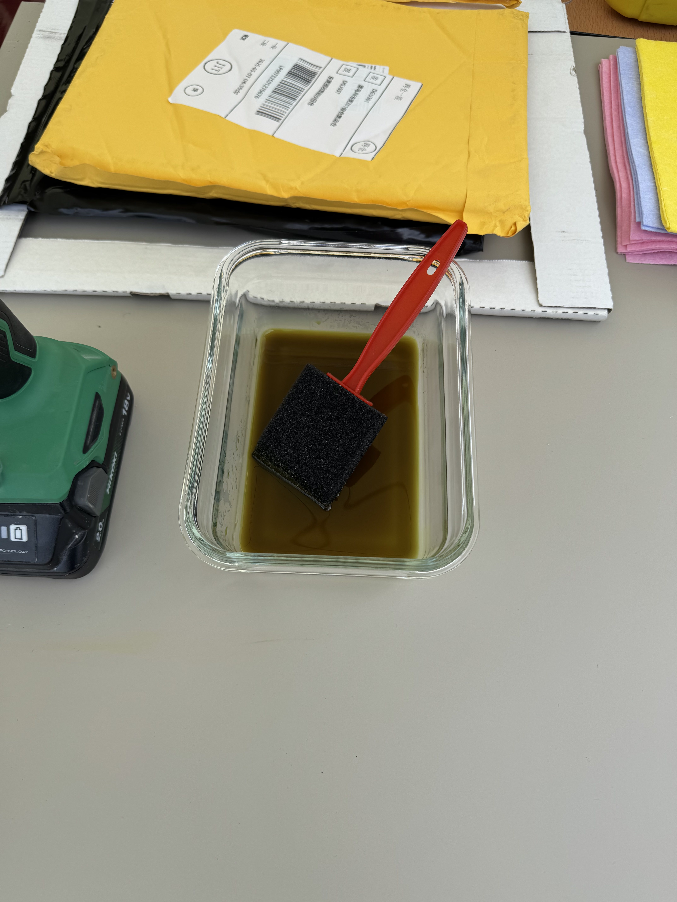
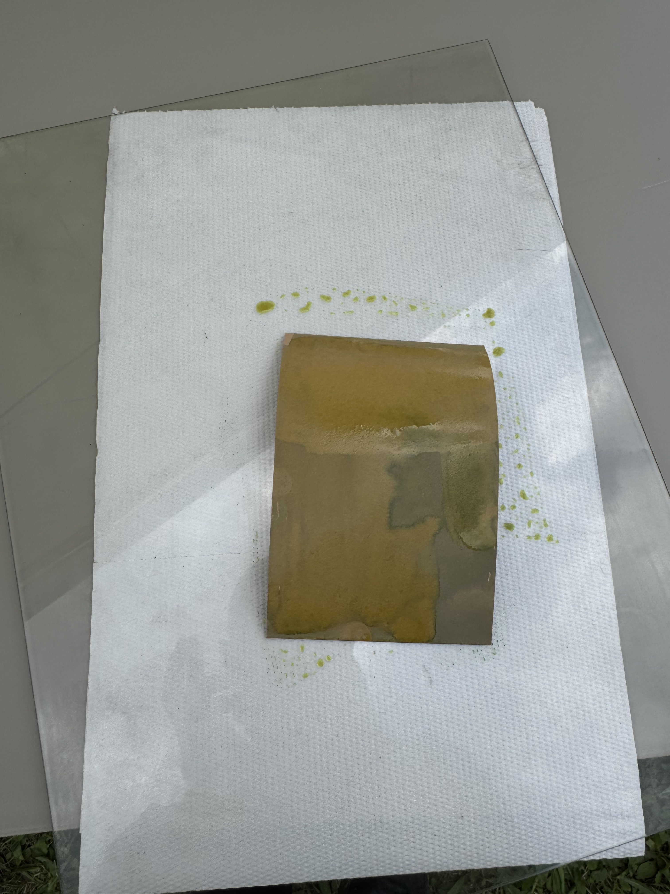
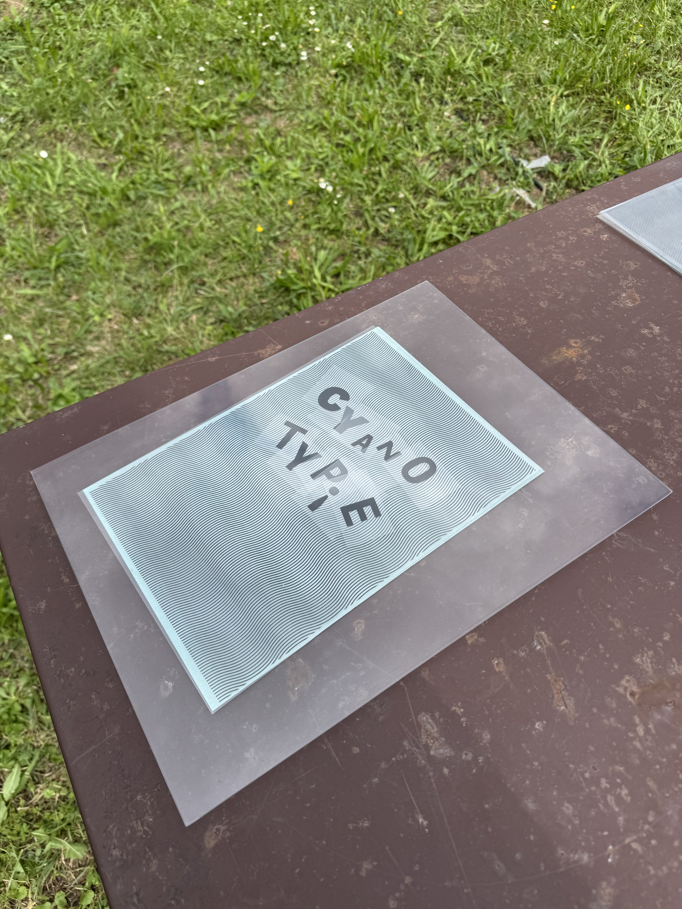
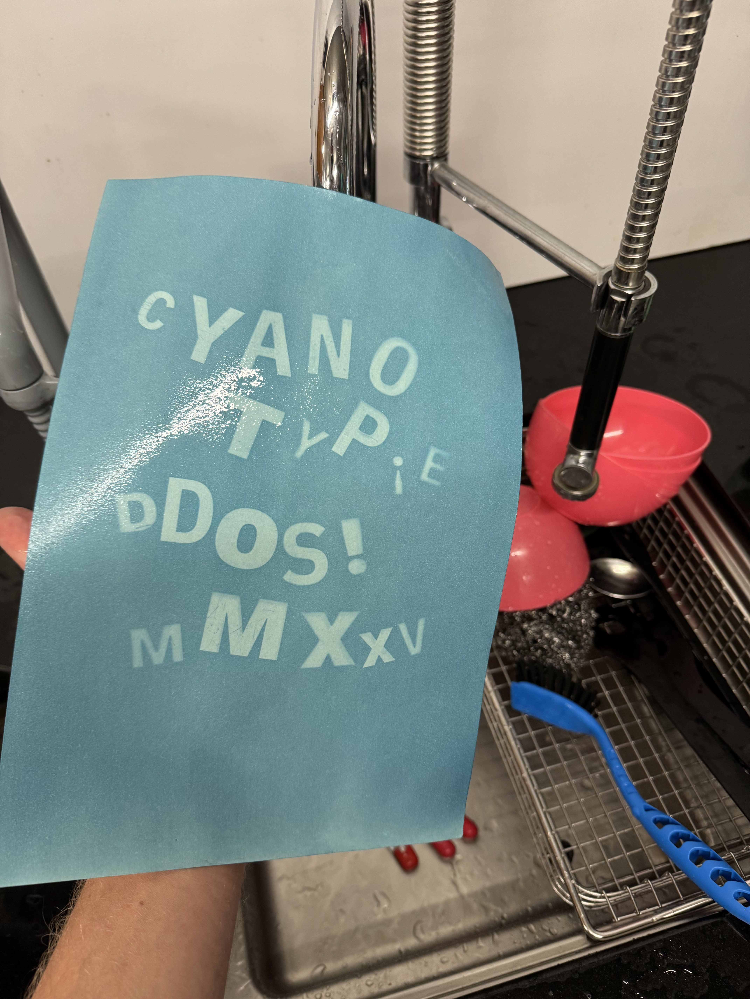
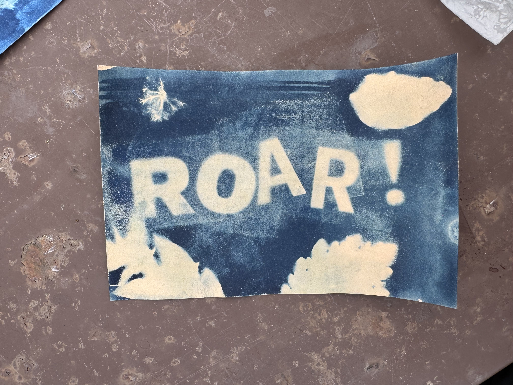
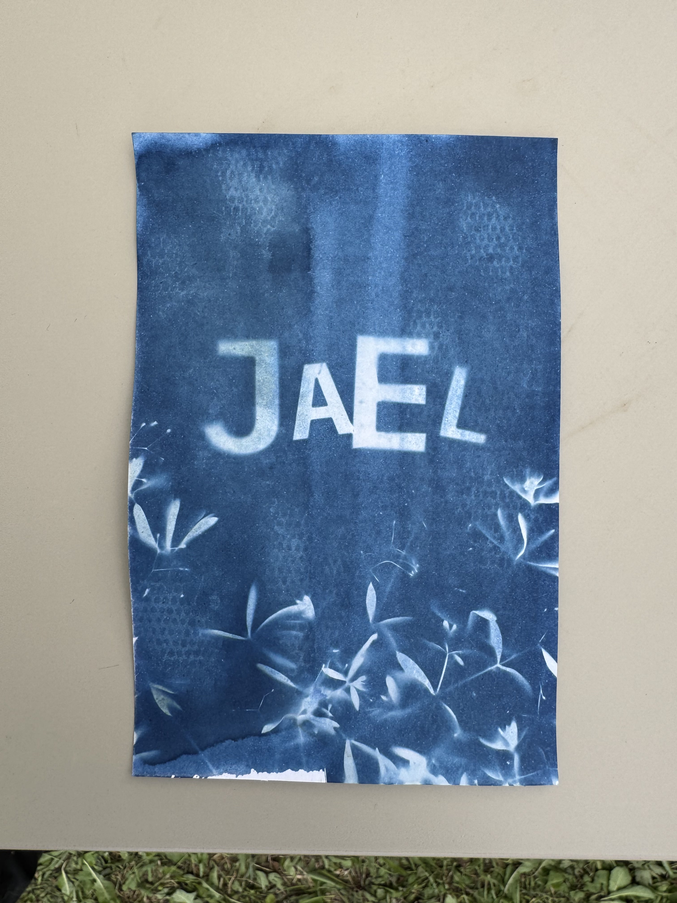

```fm
style: negative
background: true
```

## Hello _👋_

# {{process.content.frontmatter.title}}

_Selber machen!_

<footer>

2025 · Zurich · Stefan Huber

</footer>

--s--

## Vorlagen



--s--

## Emulsion



--s--

## Beschichtung



--s--

## Beschichtung



--s--

## Belichtung



--s--

## Waschen/Fixieren



--s--

## Resultate

<div class="grid">
<div class="col7 img--w100p">



</div>
<div class="col4 img--w100p">



</div>
</div>

--s--

```fm
style: negative
background: true
```

## Merci

# _Fragen?_
